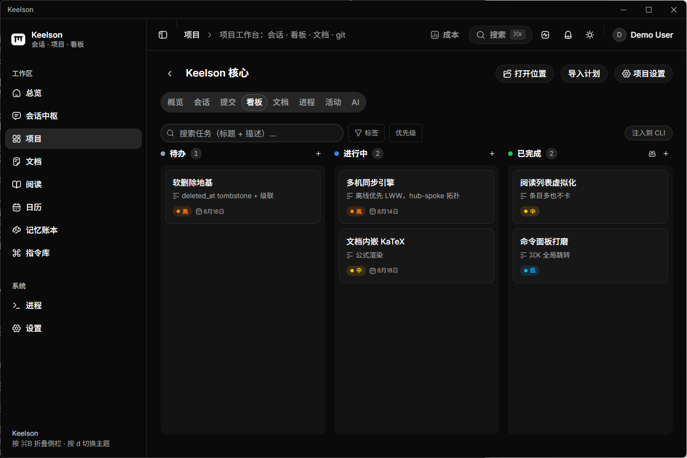
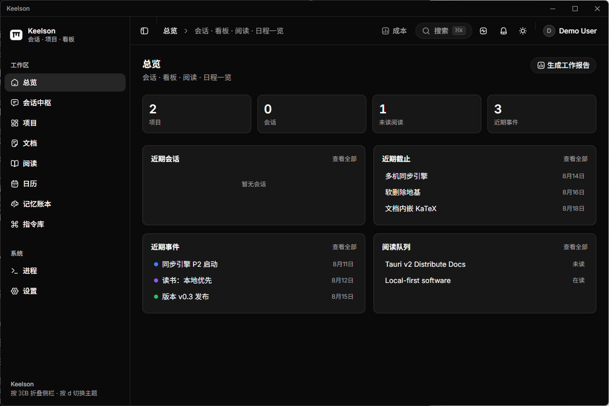
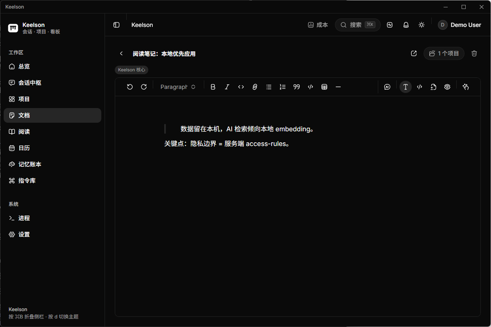
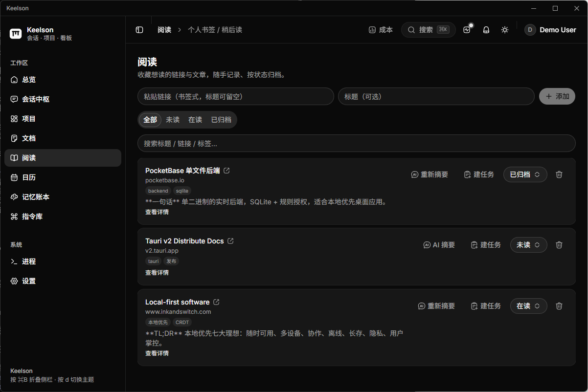
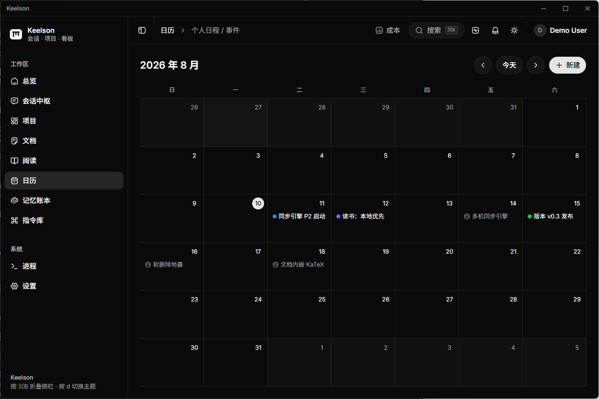
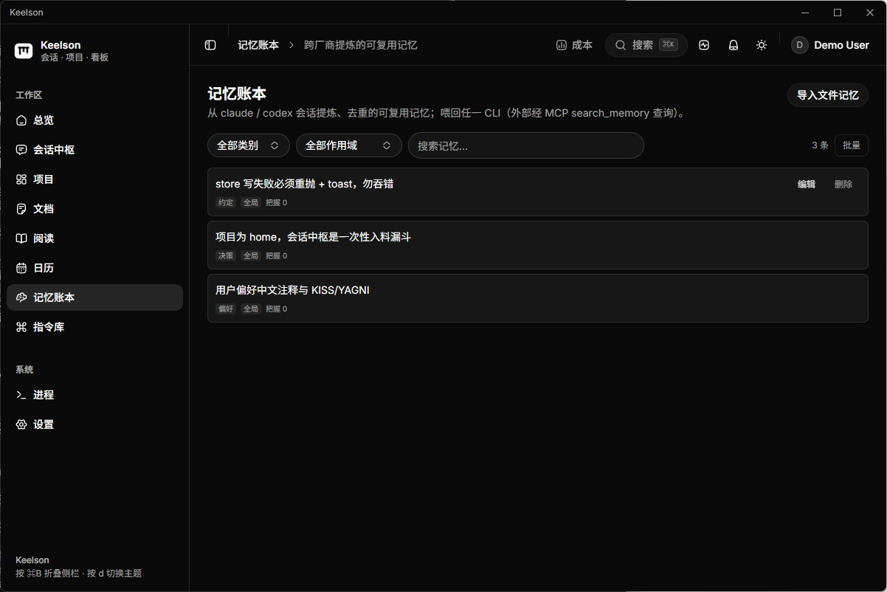
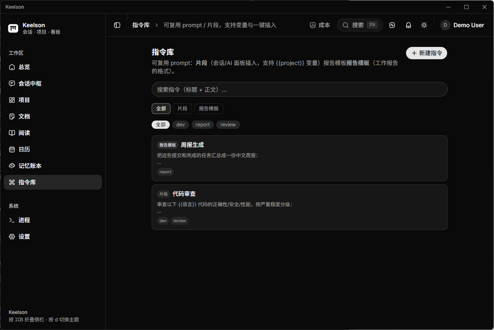

<div align="center">
  
  <h1>Keelson</h1>
  <p><b>A local-first AI workspace</b> — gathers your scattered AI-CLI sessions, projects, tasks, and docs into one place.</p>
  <p><sub><a href="README.md">简体中文</a> · English</sub></p>
  <p>
    
    
    <a href="https://github.com/akapril/keelson/releases"></a>
    <a href="LICENSE"></a>
    <a href="https://linux.do"></a>
  </p>
</div>

---

Keelson is a local-first, cross-platform desktop app that brings your scattered AI-CLI sessions, projects, tasks, and documents together. Your data stays on your machine by default — session transcripts never enter the database, AI retrieval favors local embeddings, and content is never sent to third parties.

## Features

- **Session hub + Spotlight** — Aggregates sessions from local CLIs (Claude / Codex, etc.), full-text search (Tantivy + jieba), a global hotkey for instant recall, and one-click terminal-context restore.
- **Project board** — Two-tier project model: any directory with sessions becomes a lightweight project automatically, and can be "promoted" to a managed board (tasks / workflows / drag-to-reorder / templates) with two-way session↔task traceability.
- **Docs / Calendar** — Versioned documents (optimistic concurrency, slash commands, KaTeX, inline AI) and a calendar with recurrence rules and reminders.
- **AI Chat + RAG** — Configurable multi-provider (Anthropic / OpenAI-compatible / local), scoped tools authorized via your PocketBase token, retrieving past sessions to answer "how did I solve X last time".
- **Distillation** — Session → candidate extraction → confirm → materialize into docs / tasks / calendar, with provenance back-links.
- **Reading · Memory ledger · MCP Server** — Save external articles with AI summaries (paste body text for login-walled sites); a review-gated memory ledger; expose MCP tools so other AIs can read/write workspace data.
- **Web remote access** — Device pairing + Tailscale to reach your workspace's terminal / sessions / notifications from a phone or browser; token auth, rate-limiting, off by default.
- **Process manager + interactive terminal** — A built-in PTY terminal manages long-running processes with sudo password interaction; live log viewing / copy; command favorites and history.
- **Prompt library · Work reports · Command palette** — Reusable `{{variable}}` prompt templates, AI-summarized work reports, and a ⌘K global command palette.
- **Bilingual + auto-update** — English / Chinese i18n; built-in in-app auto-update (minisign-verified), checked on launch and silently every 6 hours.

## Screenshots

<div align="center">
  <br/>
  <sub><b>Project board</b> — To-do / In progress / Done, with priorities and due dates, one-click "inject into CLI"</sub>
</div>

<table>
<tr>
<td width="50%"><br/><sub><b>Dashboard</b> — sessions / board / reading / schedule in one place</sub></td>
<td width="50%"><br/><sub><b>Docs</b> — slash commands / KaTeX / inline AI</sub></td>
</tr>
<tr>
<td><br/><sub><b>Reading</b> — save + AI summaries, archive by status</sub></td>
<td><br/><sub><b>Calendar</b> — events / recurrence / reminders</sub></td>
</tr>
<tr>
<td><br/><sub><b>Memory ledger</b> — review-gated cross-session memory</sub></td>
<td><br/><sub><b>Prompt library</b> — {{variable}} templates, one-click insert</sub></td>
</tr>
</table>

## Install

### Package managers

| Platform | Command | Status |
|---|---|---|
| Windows · winget | `winget install akapril.Keelson` | Available once the manifest is published (CI ready, see [`packaging/`](packaging/README.md)) |
| Windows · scoop | `scoop bucket add keelson <your-bucket> && scoop install keelson` | Needs a bucket (scaffold in `packaging/scoop/`) |
| Linux · AUR | `yay -S keelson-bin` | Needs an AUR push (scaffold in `packaging/aur/`) |
| macOS · brew | `brew install --cask keelson` | Planned (requires Apple notarization; not yet possible) |

> These commands require publishing a manifest to each ecosystem first — one-time steps in [`packaging/README.md`](packaging/README.md). Until then, use the one-liner script or manual download below.

### One-liner script (works today)

**Windows** (PowerShell):

```powershell
irm https://raw.githubusercontent.com/akapril/keelson/master/install.ps1 | iex
```

**macOS / Linux**:

```bash
curl -fsSL https://raw.githubusercontent.com/akapril/keelson/master/install.sh | sh
```

The script pulls the **latest published release** from GitHub Releases and installs the right package for your platform / architecture.

### Manual download

Grab a package from [Releases](https://github.com/akapril/keelson/releases):

| Platform | Package | How to install |
|---|---|---|
| **Windows** x64 | `*-setup.exe` (NSIS) or `*.msi` | Double-click. If SmartScreen warns "unknown publisher" → "More info" → "Run anyway". |
| **macOS** Apple Silicon | `*_aarch64.dmg` | Open the dmg, drag Keelson into Applications. First launch: see ⚠️ below. |
| **macOS** Intel | `*_x64.dmg` | Same as above. |
| **Linux** x64 | `*.AppImage` | `chmod +x Keelson_*.AppImage && ./Keelson_*.AppImage` (portable, no install). |
| **Linux** x64 | `*.deb` | `sudo dpkg -i Keelson_*.deb` (if deps missing: `sudo apt-get -f install`). |

> ⚠️ **macOS "is damaged / cannot verify developer" on first launch**: the app is ad-hoc signed and not Apple-notarized. Fix either way:
> - Right-click the app → "Open" → "Open" again; or System Settings → Privacy & Security → "Open Anyway".
> - Or run: `xattr -dr com.apple.quarantine /Applications/Keelson.app`
>
> (The one-liner script already does this for you.)

> 💡 **Auto-update**: after installing you don't need to download again — the app updates itself in place.

## Quick Start

After installing and opening Keelson (local-first, **no login**, works out of the box):

1. **Generate sessions**: run `claude` / `codex` in any directory as you normally would — sessions show up automatically in the **Session hub** (full-text searchable, one-click context restore).
2. **Promote to a project**: promote a directory you work in often to a project — its **board / docs / processes / AI** all live under that project workspace.
3. **Let AI read/write the workspace**: connect `claude` / `codex` to Keelson's MCP (below) so it can create tasks and write docs straight into your board.
4. **Distill as you go**: turn conclusions from a session into docs / tasks / calendar entries (with provenance back-links); drop external articles into **Reading** for AI summaries.

> Data stays on your machine by default — no login, no upload (see "Privacy Boundary").

## Connect your AI CLI (MCP)

Keelson ships a built-in MCP server so local `claude` / `codex` (and any MCP client) can operate your **board tasks** and **docs** directly, authorized by owner-only rules (only your own data).

**One-click in the app**: open **Settings → MCP (claude / codex)** and click "**Connect Claude Code**" or "**Connect Codex**" — it writes the client config (`~/.claude.json` / `~/.codex/config.toml`) automatically, no manual commands.

Advanced / manual setup, available tools, and verification: [`docs/mcp-setup.md`](docs/mcp-setup.md).

## Remote access (Web)

Securely reach your local Keelson from your **phone / tablet / another computer** — browse the workspace, view sessions and notifications, and even drive `claude` / `codex` remotely via a **web terminal**.

- **Two-layer security**: ① a Tailscale private network (only devices on your own account can reach it — not the public internet) ② an app **pairing token** (external devices enter a pairing code once, then authenticate by token, with rate-limiting and revocation). **Off by default**; enable it explicitly in Settings.
- **What you can do remotely**: web terminal (run the CLI), workbench session list, notifications — a mobile-first responsive UI.
- **Setup**: install Tailscale on both machines (same account) → enable the "Web gateway" in Settings and pair → access over HTTPS via `tailscale serve` (the `Secure` cookie requires HTTPS, see the doc).
- ⚠️ The remote terminal can run arbitrary commands on your machine — only pair **trusted devices**; if a device is lost, revoke its token in Settings.

Full setup steps in [`docs/web-remote-access.md`](docs/web-remote-access.md).

## Tech Stack

| Layer | Choice |
|---|---|
| Shell | Rust + **Tauri v2** |
| Frontend | React 19 · TypeScript · Tailwind 4 · shadcn/ui · Zustand |
| Data | **PocketBase** (sidecar, bound to 127.0.0.1; every table has owner + access-rules, multi-user ready) |
| Search | Tantivy + jieba (local full-text) |
| Remote | axum gateway + device pairing (token) + Tailscale; portable-pty terminal |

## Development

**Prerequisites:** Node 20+, pnpm, Rust stable. On Linux also install `libgtk-3-dev libwebkit2gtk-4.1-dev librsvg2-dev libayatana-appindicator3-dev`.

```bash
pnpm install
pnpm tauri dev      # launch the app (first run auto-downloads the platform's PocketBase sidecar)
```

Common checks:

```bash
pnpm lint           # eslint
pnpm exec tsc --noEmit
pnpm test           # vitest
cargo test --manifest-path src-tauri/Cargo.toml --lib
```

## Build

```bash
pnpm tauri build    # artifacts under <target>/release/bundle/
```

The PocketBase sidecar is fetched by `scripts/fetch-pocketbase.mjs` during the `prebuild` step, matched to the current platform triple and placed into `src-tauri/binaries/` following Tauri's sidecar naming convention.

Release: push a `v*` tag to trigger [`release.yml`](.github/workflows/release.yml), which cross-builds all four platforms into a single draft Release; after you Publish it, older versions detect the update in-app.

## Privacy Boundary

Session transcripts stay on disk; only metadata enters PocketBase. AI retrieval favors local embeddings and never sends content to third parties. Destructive operations are not registered as AI tools — server-side access-rules are the authorization boundary. Web remote access is off by default; once enabled, only token-authenticated paired devices can connect.

## FAQ

- **Do I need to sign up / log in?** No. Local mode is login-free and works out of the box; a login only appears if you explicitly configure a remote PocketBase for multi-device use.
- **Is my data uploaded?** No. Data stays on your machine by default; only when you explicitly invoke an AI provider is the needed content sent to the model you configured.
- **Which CLIs are supported?** Any AI-CLI that writes sessions to disk — primarily `claude` / `codex` (local sessions are auto-scanned).
- **Multi-machine sync?** Planned (offline-first, single-user LWW; see `docs/`). Today each machine's data is independent.
- **macOS won't open ("is damaged")?** The app isn't notarized — see the Gatekeeper bypass in the Install section (right-click Open / `xattr` / the one-liner does it for you).

## Data & Backup

All app data lives in the local PocketBase `pb_data` directory (Settings → Backend → "Open data directory" jumps there):

| Platform | Path |
|---|---|
| Windows | `%APPDATA%\com.keelson.app\pb_data` |
| macOS | `~/Library/Application Support/com.keelson.app/pb_data` |
| Linux | `~/.local/share/com.keelson.app/pb_data` |

Backup = quit Keelson and copy the whole directory (`data.db` is the main store, `storage/` holds doc images). Sessions themselves aren't here — they're live scans of `~/.claude` etc., not stored by Keelson.

## License

[MIT](LICENSE) © akapril
